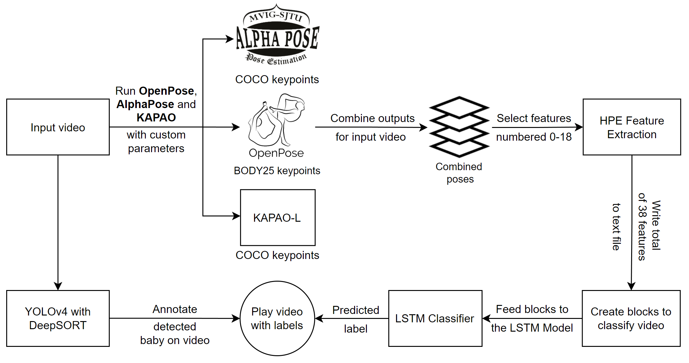

= About the project

* The goal of this research is to assist new parents by addressing pose-based real-time body movements of babies (such as arching back, headbanging, kicking legs, rubbing eyes, stretching, sucking fingers) and making sense of their activities.

* Three HPE (Human Pose Estimation) models are used and these models are compared in terms of deep learning evaluations.

== The dataset

* The dataset consists of 145 video clips for six different activity classes: arching back, sucking fingers, stretching, kicking legs, rubbing eye and headbanging.

** Crawled from video sharing platforms such as YouTube, TikTok, etc.

* These video clips are fed to HPE (Human Pose Estimation) models such as https://github.com/CMU-Perceptual-Computing-Lab/openpose[OpenPose, role=external,window=_blank], https://github.com/MVIG-SJTU/AlphaPose/tree/pytorch[AlphaPose, role=external,window=_blank], and https://github.com/wmcnally/kapao[KAPAO, role=external,window=_blank].

** These coordinate outputs of body parts are normalized, preprocessed, and used in the deep learning model to predict activities.

== Data pre-processing

* JSON/CSV outputs of HPE models have excess information for our application.

* For pre-processing, extracting only x and y coordinates of detected body parts is necessary for our deep learning model.

* Pre-processing steps for:

** AlphaPose https://github.com/meyurtsever/BabyPose/blob/main/alphapose/1_json_to_txt_alphaPose.ipynb[-> (1_json_to_txt_alphaPose.ipynb),role=external,window=_blank]

** KAPAO https://github.com/meyurtsever/BabyPose/blob/main/kapao/1_json_to_txt_kapao.ipynb[-> (1_json_to_txt_kapao.ipynb),role=external,window=_blank]

** OpenPose https://github.com/meyurtsever/BabyPose/blob/main/openpose/1_json_to_txt_openpose.ipynb[-> (1_json_to_txt_openpose.ipynb),role=external,window=_blank]

* Finally, pre-processed HPE outputs are put together to create train and test datasets (See merge_all_txt notebooks for each HPE model).

== All of the steps for the OpenPose HPE

= Installation

* We recommend https://docs.conda.io/projects/conda/en/latest/user-guide/install/index.html[installing Anaconda or Miniconda,role=external,window=_blank] for switching between virtual environments.

* Clone the project:
[source,bash]
----
git clone https://github.com/meyurtsever/BabyPose.git
----

== YOLOv4-tiny

* We use yolov4-tiny for tracking babies in the demo. Due to its size, yolov4-tiny is uploaded to Google Drive.
** You can manually download the YOLO model https://drive.google.com/uc?id=1JVNpQvsg6oi5fzhRQuKDjQrXTGMRfpT-[from here.,role=external,window=_blank] +
** YOLOv4-tiny is a fork https://github.com/theAIGuysCode/yolov4-deepsort[from this repository.,role=external,window=_blank]

* Install https://github.com/wkentaro/gdown[gdown,role=external,window=_blank]  (for downloading large files from Google Drive):
[source,bash]
----
pip install gdown
----

In the root directory of BabyPose: +
[source,bash]
----
gdown 1JVNpQvsg6oi5fzhRQuKDjQrXTGMRfpT- --output yolov4-deepsort.zip && tar zxvf yolov4-deepsort.zip && rm yolov4-deepsort.zip
----
The above code gets the YOLOv4-tiny model from Google Drive, extracts the zip, and removes the zip file after extracting. +

You can use `Tex` or `MathML` languages for

== Install OpenPose HPE

* Create virtual environment for OpenPose
[source,bash]
----
conda create --name openpose
conda activate openpose
----
* Install OpenPose https://github.com/CMU-Perceptual-Computing-Lab/openpose#installation[from their guide,role=external,window=_blank]  (GPU is recommended).
* You'll need TensorFlow, OpenCV, and keras for the inference.
[source,bash]
----
pip install Keras==2.4.3
pip install Keras-Preprocessing==1.1.2
pip install tensorflow==2.3.0
pip install opencv-python==4.4.0.44
conda activate openpose
----

=== Inference with OpenPose

* Place demo videos to `demo` folder. +
* In the root directory of BabyPose:

[source,bash]
----
cd openpose
python predict_activity_openpose.py -i demo/baby_stretching.mp4
----

== Install AlphaPose HPE

* We use https://github.com/MVIG-SJTU/AlphaPose/tree/pytorch[ v0.3.0 version,role=external,window=_blank] of the AlphaPose in this project.

* Create virtual environment for AlphaPose
[source,bash]
----
conda create --name alphapose
conda activate alphapose
----
* Install AlphaPose https://github.com/MVIG-SJTU/AlphaPose/tree/pytorch#installation[from their guide,role=external,window=_blank]  (PyTorch GPU is recommended).
* Install dependencies for the AlphaPose inference
** `cd alphapose` + 
`pip install -r requirements.txt`
** Torch is excluded from `requirements.txt`
** Get the right one for your system https://pytorch.org/get-started/previous-versions/[from here.,role=external,window=_blank]

=== Inference with AlphaPose

* Place demo videos to `demo` folder. +
* In the root directory of BabyPose:

[source,bash]
----
python alphapose/predict_activity_alphapose.py -i demo/baby_stretching.mp4
----

== Install KAPAO HPE

* Create virtual environment for KAPAO
[source,bash]
----
conda create -n kapao python=3.6
conda activate kapao
----

* Install KAPAO https://github.com/wmcnally/kapao#setup[from their guide,role=external,window=_blank]  (PyTorch GPU is recommended).
* Install dependencies for the KAPAO inference
** `cd kapao` + 
`pip install -r requirements.txt`
** Torch is excluded from `requirements.txt`
** Get the right one for your system https://pytorch.org/get-started/previous-versions/[from here.,role=external,window=_blank]

=== Inference with KAPAO

* Place demo videos to `demo` folder. +
* In the root directory of BabyPose:

[source,bash]
----
cd kapao
python predict_activity_kapao.py -i demo/baby_stretching.mp4
----
